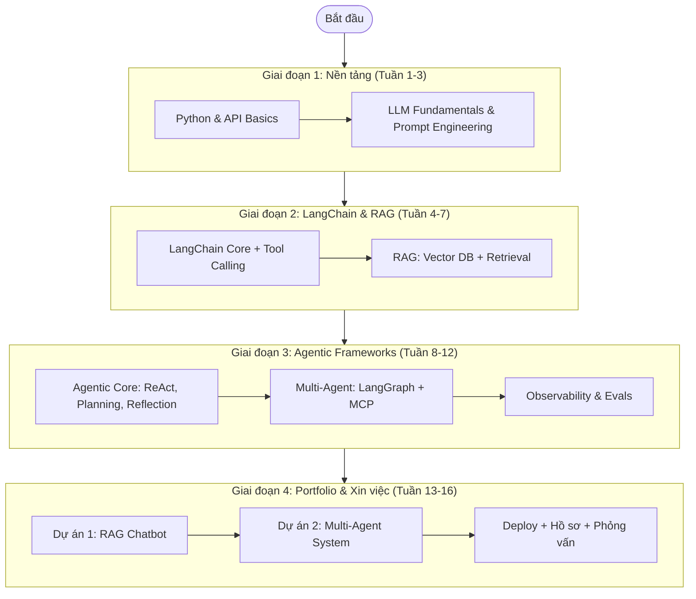

# 🤖 Lộ Trình Hoàn Hảo Trở Thành Master Agentic Developer 2026

**Phiên bản Ultimate** — Hợp nhất từ mọi nghiên cứu, đánh giá khóa học (Reddit), xác minh trên IBM CSR Udemy Business, và phân tích thị trường việc làm thực tế.

> [!NOTE]
> **Tài nguyên học tập của bạn:**
> - **Coursera Business:** [KMS Vietnam Program](https://www.coursera.org/programs/kms-software-c4ody?authProvider=kms-group)
> - **Udemy Business (IBM CSR):** [ibmcsr.udemy.com](https://ibmcsr.udemy.com/) — Mọi khóa Udemy trong lộ trình này đều **đã xác minh có sẵn** trên tài khoản IBM CSR SkillsBuild của bạn (Huu-Nghia).
>
> Tổng thời gian dự kiến: **2 – 4 tháng** học tập nghiêm túc.

---

## 🗺️ Sơ Đồ Tổng Quan (Visual Learning Path)

---

## 💼 Phân Tích Cơ Hội Việc Làm "Agentic Dev" (2026)

**Agentic AI Developer** là một trong những vị trí "nóng" nhất trong thị trường công nghệ năm 2026. Thay vì chỉ gọi API ChatGPT, doanh nghiệp cần kỹ sư xây dựng các hệ thống AI tự chủ (Agents) có khả năng suy luận, lập kế hoạch và sử dụng công cụ để hoàn thành tác vụ phức tạp.

* **Tại Bình Dương:** Tỉnh đang chuyển dịch mạnh sang mô hình "Thành phố Thông minh" với các khu CNTT tập trung (VSIP, Becamex). Các doanh nghiệp sản xuất, logistics bắt đầu tích hợp AI tự động hóa vào quy trình.
* **Việc làm Remote (Cơ hội lớn nhất):** Phần lớn vị trí AI Agent Developer cho phép làm việc hybrid/100% remote. Startup AI, công ty outsource tại TP.HCM/Hà Nội, và các dự án freelance quốc tế (Upwork, Toptal) cực kỳ khát nhân lực mảng này.
* **Kỹ năng nhà tuyển dụng tìm kiếm:** Python, Prompt Engineering, RAG, LangChain, LangGraph, AutoGen, CrewAI, MCP, và tích hợp LLMs (OpenAI, Anthropic) qua API.

---

## 📚 Lộ Trình Học Tập Chi Tiết (4 Giai Đoạn)

### 🔵 Giai Đoạn 1: Nền Tảng Python & Generative AI (Tuần 1 – 3)

**Mục tiêu:** Nắm vững Python (asyncio, JSON, Pydantic) và hiểu cách hoạt động của LLM.

#### Coursera (Xây dựng tư duy):
| Khóa học | Tác giả | Vai trò trong lộ trình |
|---|---|---|
| *AI Python for Beginners* | DeepLearning.AI (Andrew Ng) | Dành cho người mới, học Python qua lăng kính AI |
| *Generative AI with Large Language Models* | DeepLearning.AI & AWS | Hiểu sâu vòng đời phát triển LLM app, Tokens, Context Windows |
| *Generative AI Fundamentals Specialization* | IBM | Nắm bắt tư duy nền tảng GenAI |

#### Udemy IBM CSR (Thực hành) — ✅ Đã xác minh có sẵn:
| Khóa học | Tác giả | Vai trò trong lộ trình |
|---|---|---|
| *100 Days of Code: The Complete Python Pro Bootcamp* | Dr. Angela Yu | Học nhanh Python cơ bản, làm quen REST API |

> [!IMPORTANT]
> **Không trùng lặp:** Coursera ở giai đoạn này dạy **tư duy** (LLM hoạt động thế nào, Transformer là gì). Udemy dạy **code thực hành** (Python syntax, project nhỏ). Hai nguồn bổ trợ nhau, không trùng nội dung.

---

### 🟢 Giai Đoạn 2: Phát Triển Ứng Dụng LLM & RAG với LangChain (Tuần 4 – 7)

**Mục tiêu:** Kết nối LLM với dữ liệu riêng (RAG) và công cụ bên ngoài thông qua LangChain.

#### Udemy IBM CSR (Ưu tiên hàng đầu) — ✅ Đã xác minh có sẵn:
| Khóa học | Tác giả | Review từ Reddit |
|---|---|---|
| **LangChain- Agentic AI Engineering with LangChain & LangGraph** | **Eden Marco** | ⭐ Cộng đồng khen ngợi cực kỳ tích cực. Cách tiếp cận thực chiến, đi thẳng vào "code → production". Cộng đồng Discord đi kèm rất sôi nổi. **Lưu ý:** LangChain cập nhật liên tục, cần kết hợp đọc Documentation chính thức. |
| *Langchain for beginners: Build GenAI LLM Apps in Easy Steps* | Bharath Thippireddy | Lựa chọn bổ sung dễ tiếp cận hơn nếu khóa trên hơi khó |

#### Coursera (Chứng chỉ):
| Khóa học | Tác giả | Review từ Reddit |
|---|---|---|
| *IBM RAG and Agentic AI Professional Certificate* | IBM | Lộ trình bài bản, chứng chỉ uy tín (tốt cho CV LinkedIn). Tuy nhiên Reddit đánh giá hơi "lý thuyết suông", thiếu lab code chuyên sâu so với Udemy. |

> [!IMPORTANT]
> **Không trùng lặp:** Khóa Udemy (Eden Marco) dạy **code LangChain từ A-Z** với dự án thực tế. Khóa Coursera (IBM RAG) dạy **kiến trúc hệ thống RAG** ở mức high-level và cấp chứng chỉ. Nội dung hoàn toàn khác tầng (implementation vs. architecture).

---

### 🔷 Giai Đoạn 3: Chuyên Sâu Agentic AI Frameworks (Tuần 8 – 12)

**Mục tiêu:** Chuyển ứng dụng từ dạng "Hỏi-Đáp" sang dạng "Tự hành" (Agentic). Học Multi-Agent, MCP, và Observability.

#### Coursera (Xây dựng tư duy cốt lõi):
| Khóa học | Tác giả | Review từ Reddit |
|---|---|---|
| **Agentic AI** | **DeepLearning.AI (Andrew Ng)** | ⭐ Được coi là khóa "bắt buộc phải xem". Hoàn hảo để hiểu Core concepts: Tool use, Reflection, Planning, Multi-agent. Xây dựng "mental model" cực vững. **Điểm yếu:** Khá nặng lý thuyết, ít code. |
| *Building AI Agents and Agentic Workflows Specialization* | IBM | Học thêm về AI Orchestration |
| *IBM Generative AI Engineering Professional Certificate* | IBM | Kiến thức toàn diện về LLMs, Hugging Face, PyTorch (cho ai muốn đi sâu model) |

#### Udemy IBM CSR (Thực chiến code) — ✅ Đã xác minh có sẵn:
| Khóa học | Tác giả | Review từ Reddit |
|---|---|---|
| **AI Engineer Agentic Track: The Complete Agent & MCP Course** | **Ed Donner** | ⭐ Rất tốt cho hệ thống Agentic phức tạp và khái niệm MCP (Model Context Protocol). Được đánh giá "heavy-coding", rèn tay nghề xuất sắc. |
| *Complete Agentic AI Bootcamp With LangGraph and Langchain* | Krish Naik | Bootcamp toàn diện (~39 giờ), tập trung thực chiến nhiều project nhỏ |

> [!IMPORTANT]
> **Không trùng lặp:** Andrew Ng (Coursera) dạy **tư duy** về Agent (Planning, Reflection — trả lời câu hỏi "Tại sao?"). Ed Donner (Udemy) dạy **code chi tiết** Agent + MCP (trả lời câu hỏi "Làm thế nào?"). Eden Marco đã học ở Giai đoạn 2 sẽ **không** bị lặp lại vì giai đoạn đó tập trung vào RAG + LangChain cơ bản, còn giai đoạn này tập trung vào Agentic Workflow + Multi-Agent + MCP.

#### Nội dung kỹ thuật nâng cao (Tự học bổ sung):
* **Observability:** Dùng Langfuse, Phoenix, hoặc Helicone để trace từng bước suy luận của Agent.
* **Evaluations (Evals):** Chấm điểm tự động độ chính xác (RAGAS, "LLM-as-a-Judge").
* **Security & Sandboxing:** Prompt Injection defense, môi trường chạy code an toàn (E2B, Modal, Docker sandbox).

---

### 🔴 Giai Đoạn 4: Xây Dựng Portfolio & Xin Việc (Tuần 13 – 16)

**Mục tiêu:** Có sản phẩm thực tế chứng minh năng lực. Deploy được. Sẵn sàng phỏng vấn.

#### Dự án thực hành bắt buộc:

| # | Dự án | Công nghệ | Mô tả |
|---|---|---|---|
| 1 | **RAG Chatbot** | LangChain + OpenAI + ChromaDB | Chatbot tư vấn luật lao động VN hoặc quy định nội bộ công ty. Đọc PDF, trả lời chính xác dựa trên tài liệu. |
| 2 | **Multi-Agent System** | CrewAI hoặc LangGraph | Đội Agent tự động: (1) Thu thập tin tức, (2) Phân tích tài chính, (3) Viết báo cáo tổng hợp. |

#### Deploy & Hồ sơ:
* **Deploy:** Đưa ứng dụng lên **Streamlit Community Cloud** hoặc **Vercel** để nhà tuyển dụng dùng thử trực tiếp.
* **CV Keywords:** `AI Agent`, `LangChain`, `LangGraph`, `CrewAI`, `RAG`, `LLMs`, `MCP`, `Prompt Engineering`.
* **Nền tảng tìm việc:** ITviec (chọn Remote), TopCV, Indeed, LinkedIn, Upwork, Toptal.

---

## ⚖️ Chiến Lược: Nên Chọn Udemy Hay Coursera?

**Câu trả lời: KẾT HỢP CẢ HAI, NHƯNG THEO THỨ TỰ VÀ TỶ LỆ ĐÚNG.**

> [!TIP]
> **Chiến lược học tối ưu nhất (80/20):**
> 1. **Bắt đầu với Coursera (Tư duy — 20% thời gian):** Dành 1-2 tuần đầu xem khóa *Agentic AI của Andrew Ng* để hiểu rõ "Agent là gì?", "Tại sao cần Planning và Reflection?". Việc này giúp bạn không bị lạc lối khi bước vào viết code.
> 2. **Chuyển sang Udemy (Thực chiến — 80% thời gian):** Dành phần lớn thời gian để "cày" khóa của **Eden Marco** và **Ed Donner**. Đây là nơi bạn thực sự gõ từng dòng code, xử lý lỗi (debug), và xây dựng sản phẩm thực tế. **Kỹ năng từ Udemy là thứ giúp bạn vượt qua vòng phỏng vấn kỹ thuật.**
> 3. **Lấy chứng chỉ Coursera (Song song, tùy chọn):** Học lướt các khóa IBM trên Coursera để **lấy Certificate** dán lên LinkedIn và CV. Nhà tuyển dụng thích chứng chỉ từ IBM, nhưng năng lực thực tế sẽ đến từ Udemy.
>
> **Tóm lại:** Dùng **Coursera để xây móng và lấy chứng chỉ**, dùng **Udemy để luyện kỹ năng code thực chiến**.

---

## 🛡️ Lời Khuyên Vàng từ Cộng đồng Reddit

> [!WARNING]
> **Từ r/AI_Agents, r/LangChain, r/learnmachinelearning:**
> - **Chứng chỉ ≠ Năng lực:** Các lập trình viên nhấn mạnh rằng chứng chỉ Coursera (IBM) rất tốt để hiểu tổng quan, nhưng *nhà tuyển dụng đánh giá cao portfolio thực tế hơn tờ chứng chỉ*. Cốt lõi là bạn build được gì.
> - **Eden Marco vs. Krish Naik:** Khóa Eden Marco được đánh giá cực cao về tính kỹ thuật, Production-ready (chuẩn kỹ sư). Khóa Krish Naik thiên về thực hành nhiều Project nhỏ. **Chọn 1 trong 2 để tránh trùng lặp** — lộ trình này đã ưu tiên Eden Marco.
> - **Thoát khỏi "Tutorial Hell":** Việc bạn tự build được một Agent giải quyết bài toán thực tế (Giai đoạn 4) sẽ có giá trị **gấp 10 lần** việc hoàn thành mọi khóa học.
> - **Đừng phụ thuộc Framework khi chưa hiểu bản chất:** Hãy chắc chắn hiểu ReAct Loop và Tool Calling ở cấp low-level trước khi "núp bóng" LangChain/LangGraph.

---

## 📋 Tổng Hợp Toàn Bộ Khóa Học (Quick Reference)

| Giai đoạn | Nền tảng | Khóa học | Tác giả | Đã xác minh? |
|---|---|---|---|---|
| 1 | Coursera | AI Python for Beginners | Andrew Ng | ✅ |
| 1 | Coursera | Generative AI with LLMs | DeepLearning.AI & AWS | ✅ |
| 1 | Coursera | Generative AI Fundamentals | IBM | ✅ |
| 1 | Udemy CSR | 100 Days of Code: Python Pro Bootcamp | Dr. Angela Yu | ✅ |
| 2 | **Udemy CSR** | **LangChain- Agentic AI Engineering with LangChain & LangGraph** | **Eden Marco** | ✅ |
| 2 | Udemy CSR | Langchain for beginners | Bharath Thippireddy | ✅ |
| 2 | Coursera | IBM RAG and Agentic AI Professional Certificate | IBM | ✅ |
| 3 | **Coursera** | **Agentic AI** | **Andrew Ng** | ✅ |
| 3 | Coursera | Building AI Agents and Agentic Workflows | IBM | ✅ |
| 3 | Coursera | IBM Generative AI Engineering Professional Certificate | IBM | ✅ |
| 3 | **Udemy CSR** | **AI Engineer Agentic Track: Complete Agent & MCP Course** | **Ed Donner** | ✅ |
| 3 | Udemy CSR | Complete Agentic AI Bootcamp | Krish Naik | ✅ |

> **Các khóa in đậm** là khóa trọng tâm (must-take). Các khóa còn lại là bổ trợ (nice-to-have).
