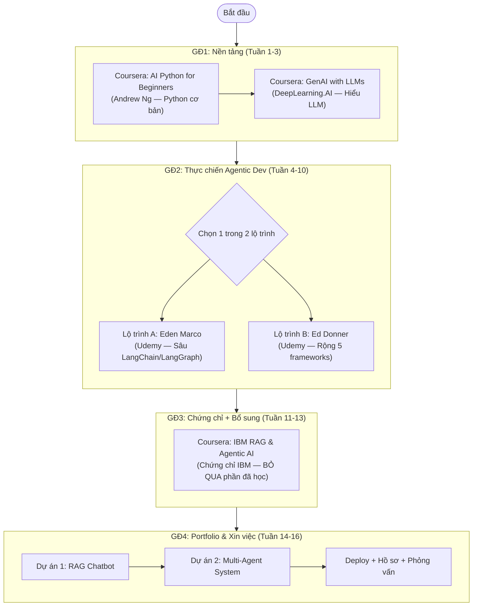

# 🤖 Lộ Trình Hoàn Hảo Trở Thành Master Agentic Developer 2026

**Phiên bản Ultimate v3** — Đã kiểm tra syllabus thực tế trên Coursera (KMS Vietnam) và Udemy (IBM CSR SkillsBuild). Đảm bảo **0% trùng lặp nội dung** giữa các giai đoạn.

> [!NOTE]
> **Tài nguyên học tập (MIỄN PHÍ qua công ty):**
> - **Coursera Business:** [KMS Vietnam Program](https://www.coursera.org/programs/kms-software-c4ody?authProvider=kms-group)
> - **Udemy Business (IBM CSR):** [ibmcsr.udemy.com](https://ibmcsr.udemy.com/) — Đã xác minh có sẵn các khóa đề xuất.
>
> Tổng thời gian dự kiến: **2 – 4 tháng** (học nghiêm túc 2-3 giờ/ngày).

---

## ⚠️ Kết Quả Kiểm Tra Chống Trùng Lặp (Overlap Analysis)

Sau khi đọc chi tiết syllabus từng khóa, tôi phát hiện **3 vấn đề nghiêm trọng** từ bản roadmap trước và đã sửa:

| Vấn đề | Chi tiết | Giải pháp |
|---|---|---|
| ❌ Gán sai tác giả | Khóa "Agentic AI" trên Coursera là của **Dr. Jules White** (Vanderbilt), 6 giờ, dành cho Leaders — **KHÔNG phải** Andrew Ng và **KHÔNG có code** | Đã chuyển khóa này thành tùy chọn bổ sung (xem nhanh 6 tiếng cho tư duy) |
| ⚠️ Eden Marco (Udemy) đã bao gồm RAG, LangGraph, MCP, Multi-Agent | Trùng lặp lớn với IBM RAG Certificate (Coursera) nếu học cả hai | **Chọn 1 trong 2** làm trọng tâm — Eden Marco (Udemy) cho code, IBM RAG cho chứng chỉ |
| ⚠️ Ed Donner (Udemy) cũng dạy LangGraph, CrewAI, MCP | Trùng lặp đáng kể với Eden Marco nếu học cả hai | **Chọn 1 trong 2** — Ed Donner dùng 5 framework (rộng hơn), Eden Marco đi sâu hơn |

---

## 🗺️ Sơ Đồ Học Tập Tối Ưu (Không Lãng Phí Effort)

---

## 📚 Lộ Trình Chi Tiết (4 Giai Đoạn — Không Trùng Lặp)

### 🔵 Giai Đoạn 1: Nền Tảng Python & Hiểu LLM (Tuần 1 – 3)

**Mục tiêu:** Viết Python cơ bản + Hiểu cách LLM hoạt động bên trong (Transformer, Tokens, Fine-tuning).

| Khóa học | Tác giả | Giờ học | Nội dung DUY NHẤT (không trùng GĐ khác) |
|---|---|---|---|
| [AI Python for Beginners](https://www.coursera.org/programs/kms-software-c4ody/learn/ai-python-for-beginners?authProvider=kms-group) | Andrew Ng (Coursera) | ~17h | Python cơ bản, biến, hàm, loop, API calls, Jupyter. **Không dạy LangChain/RAG.** |
| [Generative AI with Large Language Models](https://www.coursera.org/programs/kms-software-c4ody/learn/generative-ai-with-llms?authProvider=kms-group) | DeepLearning.AI & AWS (Coursera) | ~17h | Transformer architecture, Training lifecycle, Fine-tuning, RLHF, Scaling laws. **Không dạy Agent/Tool calling.** |

> [!IMPORTANT]
> **Tại sao 2 khóa này không trùng nhau?**
> - AI Python: Dạy **cách viết code Python** (syntax, functions, API).
> - GenAI with LLMs: Dạy **cách LLM hoạt động bên trong** (model architecture, training).
> - **Không khóa nào đụng tới LangChain, RAG, hay Agent** — đó là nội dung GĐ2.

---

### 🟢 Giai Đoạn 2: Thực Chiến Agentic Dev (Tuần 4 – 10) — CHỌN 1 TRONG 2

**Mục tiêu:** Code thực tế với LangChain, RAG, LangGraph, Agent, MCP. Đây là giai đoạn **cốt lõi**, chiếm 80% effort.

> [!CAUTION]
> **ĐỪNG học cả 2 khóa dưới đây.** Chúng trùng nhau ~60% nội dung (cả hai đều dạy LangChain, RAG, LangGraph, Agent). Chọn 1 dựa trên phong cách học của bạn.

#### 🅰️ Lộ trình A: Eden Marco (Đi sâu — Khuyến nghị)
| Khóa học | Tác giả | Giờ học | Nội dung |
|---|---|---|---|
| **LangChain- Agentic AI Engineering with LangChain & LangGraph** | Eden Marco (Udemy CSR) ✅ | ~20h | Prompt Engineering → RAG (Embeddings, VectorDB) → ReAct Agents → LangGraph (Reflection, Agentic RAG) → MCP → Multi-Agent → Production deployment |

**Ai nên chọn:** Muốn đi sâu, hiểu bản chất, code production-ready. Cộng đồng Discord hỗ trợ tốt.

#### 🅱️ Lộ trình B: Ed Donner (Đi rộng — 5 frameworks)
| Khóa học | Tác giả | Giờ học | Nội dung |
|---|---|---|---|
| **AI Engineer Agentic Track: The Complete Agent & MCP Course** | Ed Donner (Udemy CSR) ✅ | ~21h | OpenAI Agents SDK → CrewAI → LangGraph → AutoGen → MCP. 8 dự án thực tế (brochure generator, customer support agent, trading simulation) |

**Ai nên chọn:** Muốn trải nghiệm nhiều framework khác nhau, thích học qua project-based. Tốt cho ai chưa biết mình thích framework nào.

#### So sánh chi tiết 2 lộ trình:
| Tiêu chí | Eden Marco (A) | Ed Donner (B) |
|---|---|---|
| Frameworks chính | LangChain + LangGraph (sâu) | OpenAI SDK + CrewAI + LangGraph + AutoGen + MCP (rộng) |
| Phong cách | Đi sâu 1 hệ sinh thái | Thử nhiều framework, 8 projects |
| RAG coverage | Sâu (Embeddings, VectorDB, Agentic RAG) | Có nhưng ít chi tiết hơn |
| MCP coverage | Có | Có (dedicated module) |
| Reddit đánh giá | ⭐ "Production-ready, kỹ sư thực thụ" | ⭐ "Heavy-coding, rèn tay nghề" |

---

### 🔷 Giai Đoạn 3: Chứng Chỉ IBM + Bổ Sung Kiến Thức (Tuần 11 – 13)

**Mục tiêu:** Lấy chứng chỉ IBM để dán LinkedIn, và **chỉ học những phần mà GĐ2 chưa cover**.

| Khóa học | Tác giả | Tổng giờ | Cách học tối ưu |
|---|---|---|---|
| [IBM RAG and Agentic AI Professional Certificate](https://www.coursera.org/programs/kms-software-c4ody/professional-certificates/ibm-rag-and-agentic-ai?authProvider=kms-group) | IBM (Coursera) | ~101h (10 courses) | **BỎ QUA** các course trùng lặp với GĐ2. Xem bảng dưới ↓ |

#### Hướng dẫn học tối ưu IBM RAG Certificate (tránh lãng phí):

| Sub-course | Giờ | Nếu đã học Eden Marco (A) | Nếu đã học Ed Donner (B) |
|---|---|---|---|
| 1. Develop GenAI Applications: Get Started | 10h | ⏭️ Lướt nhanh (đã biết) | ⏭️ Lướt nhanh |
| 2. Build RAG Applications: Get Started | 7h | ⏭️ **Bỏ qua** (đã học kỹ) | ⚡ Xem phần RAG pipeline |
| 3. Vector Databases for RAG | 9h | ⏭️ **Bỏ qua** (đã học kỹ) | ⚡ Xem Chroma/Pinecone |
| 4. Advanced RAG with Retrievers | 8h | ⚡ **NÊN HỌC** — Reranking, Hybrid Search | ⚡ **NÊN HỌC** |
| 5. Multimodal GenAI Applications | 8h | ✅ **NÊN HỌC** — Hoàn toàn mới! | ✅ **NÊN HỌC** |
| 6. Fundamentals of Building AI Agents | 11h | ⏭️ **Bỏ qua** (đã học kỹ) | ⏭️ Bỏ qua |
| 7. Agentic AI with LangChain & LangGraph | 11h | ⏭️ **Bỏ qua** (trùng 90%) | ⚡ Ôn lại LangGraph |
| 8. Agentic AI with CrewAI, AutoGen, BeeAI | 13h | ⚡ **NÊN HỌC** — CrewAI/AutoGen mới! | ⏭️ **Bỏ qua** (đã học kỹ) |
| 9. Build AI Agents using MCP | 10h | ⏭️ Lướt nhanh (đã biết) | ⏭️ Lướt nhanh |
| 10. Capstone Project | 14h | ✅ **LÀM** — Để lấy chứng chỉ | ✅ **LÀM** |

> [!TIP]
> **Nếu chọn lộ trình A (Eden Marco):** Bạn chỉ cần học kỹ Course 4, 5, 8, 10 = **~43 giờ** thay vì 101 giờ. Tiết kiệm **~58 giờ** effort!
> **Nếu chọn lộ trình B (Ed Donner):** Bạn chỉ cần học kỹ Course 4, 5, 10 + lướt Course 2, 3 = **~54 giờ**. Tiết kiệm **~47 giờ**!

#### Khóa bổ sung tùy chọn (nếu muốn thêm tư duy):
| Khóa học | Tác giả | Giờ | Ghi chú |
|---|---|---|---|
| [Agentic AI and AI Agents: A Primer for Leaders](https://www.coursera.org/programs/kms-software-c4ody/learn/agentic-ai?authProvider=kms-group) | Dr. Jules White, Vanderbilt (Coursera) | 6h | Beginner, dành cho managers. Tốt để hiểu tư duy "Agent là gì" nhanh. **Không có code.** |

---

### 🔴 Giai Đoạn 4: Portfolio & Xin Việc (Tuần 14 – 16)

**Mục tiêu:** Có 2 sản phẩm thực tế + Deploy + Sẵn sàng phỏng vấn.

#### Dự án bắt buộc:
| # | Dự án | Công nghệ | Mô tả |
|---|---|---|---|
| 1 | **RAG Chatbot** | LangChain + OpenAI + ChromaDB | Chatbot tư vấn luật lao động VN hoặc quy định công ty. Đọc PDF, trả lời chính xác. |
| 2 | **Multi-Agent System** | CrewAI hoặc LangGraph | Đội Agent: (1) Thu thập tin tức, (2) Phân tích tài chính, (3) Viết báo cáo. |

#### Deploy & Hồ sơ:
* **Deploy:** Streamlit Community Cloud hoặc Vercel.
* **CV Keywords:** `AI Agent`, `LangChain`, `LangGraph`, `CrewAI`, `RAG`, `LLMs`, `MCP`.
* **Nền tảng tìm việc:** ITviec (Remote), TopCV, Indeed, LinkedIn, Upwork.

---

## ⚖️ Chiến Lược Tối Ưu: Coursera vs Udemy (80/20)

> [!TIP]
> **Quy tắc vàng:**
> 1. **GĐ1 — Coursera (100%):** Dành 3 tuần đầu cho Python + LLM Fundamentals. Không tìm đâu có nội dung tốt hơn Andrew Ng + DeepLearning.AI.
> 2. **GĐ2 — Udemy (100%):** Dành 6 tuần cày 1 khóa duy nhất (Eden Marco HOẶC Ed Donner). **Đây là nơi bạn thực sự thành kỹ sư.** 80% năng lực của bạn đến từ giai đoạn này.
> 3. **GĐ3 — Coursera (chọn lọc):** Chỉ học các sub-course **KHÔNG trùng** với GĐ2. Mục đích chính: **lấy chứng chỉ IBM** cho LinkedIn.
> 4. **GĐ4 — Tự build:** Không khóa học nào. Chỉ code, deploy, và xin việc.

---

## 📋 Tổng Hợp Effort Thực Tế

| Giai đoạn | Giờ học thực tế | Nền tảng | Giá trị chính |
|---|---|---|---|
| GĐ1 | ~34 giờ | Coursera (KMS) | Nền tảng Python + LLM |
| GĐ2 | ~20 giờ | Udemy (IBM CSR) | Kỹ năng code Agentic thực tế |
| GĐ3 | ~43-54 giờ (đã tối ưu) | Coursera (KMS) | Chứng chỉ IBM + Multimodal + Advanced RAG |
| GĐ4 | ~40 giờ tự code | N/A | Portfolio + Deploy |
| **Tổng** | **~137-148 giờ** | | **~2.5-3 tháng** (2h/ngày) |

---

## 🛡️ Lời Khuyên Từ Reddit (r/AI_Agents, r/LangChain)

> [!WARNING]
> - **Chứng chỉ ≠ Năng lực:** Nhà tuyển dụng đánh giá portfolio thực tế hơn tờ chứng chỉ. Nhưng chứng chỉ IBM vẫn rất tốt cho LinkedIn.
> - **Eden Marco vs. Ed Donner:** Cả hai đều top-tier. Chọn 1 dựa trên phong cách, **ĐỪNG học cả hai** vì trùng 60%.
> - **Thoát Tutorial Hell:** Ở GĐ3, bạn chỉ nên coi các nội dung "Nên học" như tài liệu tra cứu. Hãy học chúng **song song** với việc build dự án cá nhân ở GĐ4 (áp dụng ngay vào code). Đừng thụ động ngồi cày nốt chứng chỉ rồi mới bắt đầu làm project.
> - **LangChain cập nhật liên tục:** Luôn kết hợp đọc Docs chính thức song song với video.
