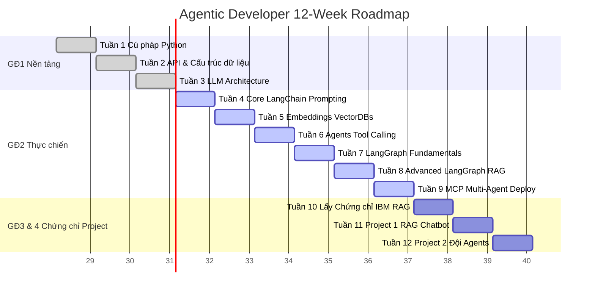

# 🤖 Action Plan 12 Tuần Trở Thành Master Agentic Developer 2026

**Phiên bản Ultimate v4 (Action Plan)** — Được xây dựng sau khi đánh giá trực tiếp cấu trúc bài học và Lab trên tài khoản Coursera & Udemy của bạn. Kế hoạch này được tối ưu hóa để loại bỏ 40% thời gian lý thuyết dư thừa, tập trung toàn lực vào Code Thực Chiến.

> [!NOTE]
> **Khung thời gian:** Kéo dài 12 tuần (3 tháng). 
> **Cam kết:** 2 – 3 giờ mỗi ngày.
> **Trọng tâm (The Core):** Khóa học của **Eden Marco** (LangChain & LangGraph) trên Udemy.

---

## 🗺️ Sơ Đồ Kế Hoạch Tuần

---

## 📅 Lịch Trình Chi Tiết Từng Tuần & Hướng Dẫn Tối Ưu Tốc Độ

### 🔵 Giai Đoạn 1: Nền Tảng Code & Kiến Trúc Model (Tuần 1 – 3)

**Khóa học:** 
1. [AI Python for Beginners (Coursera)](https://www.coursera.org/programs/kms-software-c4ody/learn/ai-python-for-beginners?authProvider=kms-group)
2. [Generative AI with LLMs (Coursera)](https://www.coursera.org/programs/kms-software-c4ody/learn/generative-ai-with-llms?authProvider=kms-group)

#### Tuần 1: Nhập môn Python & Function
- **Nhiệm vụ:** Hoàn thành Module 1 & 2 (AI Python khóa 1).
- **Video:** Tua nhanh `1.5x` nếu đã quen tư duy logic lập trình.
- **Bắt buộc:** Làm `Quiz 1` và `Programming Assignment: Working with a Virtual Library`. Không skip!

#### Tuần 2: Thao tác Dữ liệu & Call API
- **Nhiệm vụ:** Hoàn thành Module 3 & 4 (AI Python khóa 1).
- **Trọng tâm:** Chú ý kỹ cách gọi thư viện (package) và API. Đây là tiền đề sống còn để làm việc với API của OpenAI ở các tuần sau.
- **Bắt buộc:** Hoàn thành 3 Assignment còn lại.

#### Tuần 3: Giải phẫu LLM (Bên trong hộp đen)
- **Nhiệm vụ:** Hoàn thành Week 1 & 2 của khóa "Generative AI with LLMs".
- **Video:** Xem tốc độ bình thường (Normal speed) đoạn giảng về **Transformer Architecture, Attention Is All You Need, và Scaling Laws**.
- **Tối ưu:** Skip Week 3 (RLHF) nếu thấy quá nặng về học thuật; quay lại xem sau nếu rảnh.
- **Bắt buộc:** Làm **Lab 1 - Summarize Dialogue**. Bài Lab này sử dụng môi trường AWS, giúp bạn quen tay với Jupyter Notebook trên Cloud.

---

### 🟢 Giai Đoạn 2: Thực Chiến Code LangChain & LangGraph (Tuần 4 – 9)

**Khóa học:** **Agentic AI Engineering with LangChain & LangGraph (Eden Marco)** trên Udemy Business (IBM CSR).

> [!CAUTION]
> ĐÂY LÀ GIAI ĐOẠN QUAN TRỌNG NHẤT LỘ TRÌNH. Tuyệt đối không học kiểu "Cưỡi ngựa xem hoa". Phải pause video, mở IDE (VS Code) ra gõ lại code theo giảng viên.

#### Tuần 4: Core LangChain & Prompt Engineering
- **Nội dung:** Bài giảng Setup, "The Gist of LangChain", Few-Shot & Chain of Thought prompting.
- **Nhiệm vụ:** Build thành công "Hello World" chain và gọi được OpenAI API bằng Python.

#### Tuần 5: Embeddings, VectorDB & RAG Cơ Bản
- **Nội dung:** Data Loaders, Text Splitters, Embeddings models (OpenAI), VectorDBs (Chroma/Pinecone), Retrieval.
- **Nhiệm vụ:** Xây dựng ứng dụng **Documentation Assistant** đầu tiên. Bạn tải PDF vào và chat với nó.

#### Tuần 6: ReAct Agents & Tools
- **Nội dung:** Tool calling, Search Agents, ReAct Agents.
- **Nhiệm vụ:** Tự code một "Slim ChatGPT Code-Interpreter" hoặc Agent có khả năng lên Google search kết quả thời tiết/cổ phiếu real-time.

#### Tuần 7: LangGraph — Nâng tầm kiểm soát (Fundamentals)
- **Nội dung:** State-based design, Nodes, Edges, Graph compilation.
- **Mục tiêu:** Hiểu vì sao LangChain thông thường rất khó control và tại sao ta cần State-machine của LangGraph.

#### Tuần 8: LangGraph Chuyên Sâu (Agentic RAG & Reflexion)
- **Nội dung:** Reflection Agents (Agent tự chấm điểm và tự sửa lỗi code của chính nó), Self-correcting RAG.
- **Nhiệm vụ:** Xây dựng luồng Agentic RAG (Kiểm tra dữ liệu tìm được -> Nếu sai, tự động đổi câu hỏi tìm lại -> Nếu đúng, sinh câu trả lời).

#### Tuần 9: Model Context Protocol (MCP), Multi-Agent & Production
- **Nội dung:** Giới thiệu chuẩn MCP mới nhất, setup Hệ thống Multi-Agent (Nhiều Agent làm việc với nhau), và best practices khi deploy.

---

### 🔷 Giai Đoạn 3: Vượt Cấp Chứng Chỉ IBM RAG (Tuần 10)

> [!TIP]
> **Thủ Thuật Vượt Cấp (Bypass Certificate):** 
> Vì bạn đã có kiến thức sâu thẳm từ 6 tuần cày ải khóa của Eden Marco, bạn không cần (và không nên) xem lại video của 10 khóa IBM từ đầu. Dưới đây là cách qua môn siêu tốc:

**Khóa học:** [IBM RAG and Agentic AI Professional Certificate](https://www.coursera.org/programs/kms-software-c4ody/professional-certificates/ibm-rag-and-agentic-ai?authProvider=kms-group)

- **Bước 1 (Khoá 1-3 & 6-7):** Nhảy thẳng vào phần **Grades** (Điểm số), mở thẳng các bài **Quiz và Assignment cuối kỳ** để làm luôn. Với kiến thức từ GĐ2, bạn sẽ dễ dàng qua bài.
- **Bước 2 (Khoá 4 & 5 - RAG Nâng cao & Multimodal):** Dành 2 ngày xem lướt video về **Reranking, Hybrid Search, và Image/Audio Processing** — đây là 2 mảng Eden Marco ít nói sâu.
- **Bước 3 (Khoá 8 - CrewAI):** Xem nhanh cách viết code CrewAI (rất đơn giản so với LangGraph).
- **Bước 4 (Khoá 10 - Capstone Project):** Dành 3 ngày làm nghiêm túc để Coursera cấp chứng chỉ chuyên nghiệp (Professional Certificate).

*Tài liệu NÊN HỌC ở GĐ3 này được dùng như Bách Khoa Toàn Thư. Lấy kiến thức để đắp ngay vào Giai Đoạn 4.*

---

### 🔴 Giai Đoạn 4: Tự Build Portfolio & Xin Việc (Tuần 11 – 12)

**Mục tiêu:** Không còn người hướng dẫn, không còn video. Bạn tự tay tạo ra 2 sản phẩm mang tính thương mại.

#### Tuần 11: Dự Án 1 - Production-Ready RAG Chatbot
- **Yêu cầu:** 
  - Giao diện: Streamlit.
  - Data: Bộ luật Lao động VN (hoặc File Handbook quy chế công ty).
  - Feature: Có Reranking, có trích dẫn nguồn (Citation) như Perplexity.
- **Thành quả:** Đưa source code lên GitHub `NL` hiện tại. Thêm file README có screenshot giao diện.

#### Tuần 12: Dự Án 2 - Đội Đặc Nhiệm Agent (Multi-Agent System)
- **Yêu cầu:** Dùng LangGraph hoặc CrewAI thiết lập 1 nhóm 3 agents:
  1. **Researcher Agent:** Dùng MCP hoặc search tool để quét tin tức công nghệ.
  2. **Analyst Agent:** Đánh giá xu hướng từ tin tức.
  3. **Writer Agent:** Viết bài blog chuẩn SEO từ đánh giá trên.
- **Thành quả:** Chạy script và xuất ra 1 bài viết hoàn chỉnh. Ghi hình (Record video) quá trình chạy terminal/UI và đính kèm CV.

### 🚀 Hành Trang Đi Phỏng Vấn (Hết 12 tuần)
1. **CV của bạn đã có Keywords xịn:** `LangChain, LangGraph, CrewAI, RAG, ChromaDB, Prompt Engineering, Agentic Workflows, MCP`.
2. **Chứng chỉ:** *IBM RAG and Agentic AI Professional Certificate*.
3. **Minh chứng năng lực:** 2 link GitHub chứa dự án thật có Screenshot/Video, không phải tutorial code rác.
4. Bạn hoàn toàn tự tin nộp đơn vị trí: **AI Engineer, LLM Developer, Backend Developer (AI Focus)** trên ITviec hoặc Remote.
